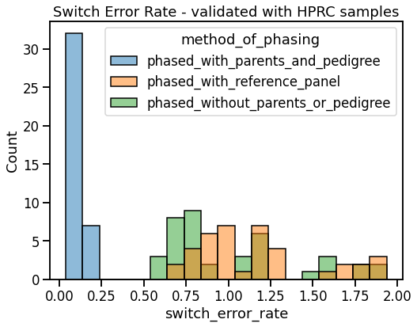
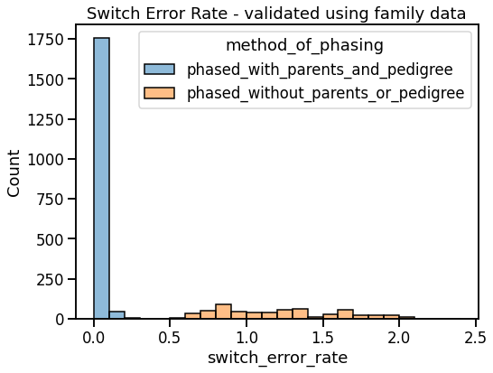

[](https://doi.org/10.5281/zenodo.7612953)

# Computationally phased T2T 1KGP panel
This repository contains variant data produced in [Aganzov et al 2022](https://www.science.org/doi/10.1126/science.abl3533) that has been computationally phased using SHAPEIT5 ([Hofmeister et al 2022](https://www.biorxiv.org/content/10.1101/2022.10.19.512867v2)). One advantage of using SHAPEIT5 is the ability to phase rare variants and/or singletons using an IBD-informed approach.

A tar file containing the phased T2T panel, along with another file containing phasing statistics has been uploaded to zenodo at [this link](https://zenodo.org/record/7612953#.Y-8VD3bMJPY). Please cite the zenodo repository if you find this panel to be useful in your work.

[Direct download link to phased 1KGP T2T panel.](https://zenodo.org/record/7612953/files/phased_T2T_panel.tar?download=1)

## Repository structure
- phased_T2T_panel: per-chromosomome vcf files containing phased T2T variant calls.
- pedigrees: 1000 Genomes Project pedigree files (and subsets of that pedigree)
- phasing_stats: raw output of SHAPEIT5's switch tool, which produces data evaluating the accuracy of a phased dataset.
- sample_subsets: text files containing different groups of samples used for annotating or producing subsets of vcf files.
- t2t_lifted_chrom_maps: GRCh38 chrom maps that have been lifted over to T2T coordinates using UCSC liftover. More information is provided in the folder's README.

## Reference data sources
- 1KGP variants called against T2Tv2.0: [T2T_1KGP_calls](https://s3-us-west-2.amazonaws.com/human-pangenomics/index.html?prefix=T2T/CHM13/assemblies/variants/1000_Genomes_Project/chm13v2.0/all_samples_3202/)
- T2T cytobands for plotting:[chm13v2.0_cytobands_allchrs.bed](https://s3-us-west-2.amazonaws.com/human-pangenomics/T2T/CHM13/assemblies/annotation/chm13v2.0_cytobands_allchrs.bed)
- T2T reference fasta: [chm13v2.0.fa.gz](https://s3-us-west-2.amazonaws.com/human-pangenomics/T2T/CHM13/assemblies/GCA_009914755.4/chm13v2.0.fa.gz)
- HPRC Pangenome sample variantion in T2T coordinates: [hprc-v1.0-mc-chm13.vcf.gz](https://s3-us-west-2.amazonaws.com/human-pangenomics/pangenomes/freeze/freeze1/minigraph-cactus/hprc-v1.0-mc-chm13.vcf.gz)
- SHAPEIT5 1.0.0 release files: [SHAPEIT5 v1.0.0 release](https://github.com/odelaneau/shapeit5/releases/tag/v1.0.0)

# How to replicate analysis

1. Clone the repository and download the reference files that are too large for github:
```
git clone www.github.com/josephlalli/phasing_T2T
cd phasing_T2T
chmod +x phase_T2T.sh
wget https://s3-us-west-2.amazonaws.com/human-pangenomics/T2T/CHM13/assemblies/GCA_009914755.4/chm13v2.0.fa.gz .
wget https://s3-us-west-2.amazonaws.com/human-pangenomics/T2T/CHM13/assemblies/GCA_009914755.4/chm13v2.0.fa.gz.fai .
wget https://s3-us-west-2.amazonaws.com/human-pangenomics/pangenomes/freeze/freeze1/minigraph-cactus/hprc-v1.0-mc-chm13.vcf.gz .
wget https://s3-us-west-2.amazonaws.com/human-pangenomics/pangenomes/freeze/freeze1/minigraph-cactus/hprc-v1.0-mc-chm13.vcf.gz.tbi .
```

2. Download the T2T 1KGP calls above using your method of choice. (AWS s3 cp will be much faster than wget).

> Note: In my experience, SHAPEIT5_common used up to 40GB of memory while running. SHAPEIT5_rare, on the otherhand, is a very memory intensive program. Memory usage is dependent upon both the number of cpus used to phase and the number of variants being phased. To make memory usage more predicatble, I ran SHAPEIT5_rare on 40mb chunks using 32 cpus, resulting in memory usage of around 150-200GB at a time.

To generate the coordinates of these chromosome chunks, run the following code:

```
chunk_size=40 # or however many mb of chromosome to process at a time; the SHAPEIT5 tutorial uses 5mb chunks.
fasta_fai=chm13v2.0.fa.gz.fai
regions_file=regions.txt
python3 generate_regions_for_rare_phasing.py --fasta_fai $fasta_fai --chunk_size $chunk_size --output $regions_file
```

Finally, run the phasing script.
```
number_of_cpus_per_job=32
for i in $(seq 1 22) X; do ./phase_T2T chr$i $number_of_cpus_per_job; done
```
Alternateively, you can phase chromosomes in parallel.
```
number_of_cpus_per_job=32
num_jobs=4
echo "$(seq 1 22) X" | sed 's/ /\n/g' | parallel -j $num_jobs ./phase_T2T chr{} $number_of_cpus_per_job
```

## Switch Error Rates

Performance was measured by comparing the phased haplotypes of 39 samples shared between the Human Pangenome Reference Consortium (HPRC)'s draft human pangenome and the 1000 Genotypes dataset.

|Method of phasing variants|Switch Error Rate|+/- 95th c.i.|
|-|-|-|
|All 3202 samples, including trios, with pedigree|0.09% |0.02%|
|2002 singletons or trio children, no pedigree|1.02%|0.11%|
|39 HPRC samples, using the 3202 phased panel (with trio children, HPRC samples, and HPRC parents removed) as a reference panel |1.17%|0.13%|





## Potential errors/things to be done:
- Chromosome X was phased as if it was a normal chromosome. Instead, it should have has PAR regions phased seperately from non-PAR regions. I do not know how SHAPEIT5 handles chromosome X. Empirically, chromosome X's switch error rates are elevated compared to autosomal chromosomes, but performance is still pretty good. ("Pretty good" should illustrate that chromosome X needs a more thorough evaluation.)  
- Currently, SHAPEIT5 rare variant phasing segfaults if there are any mendelian errors in a pedigree-specified trio. Therefore, when using bcftools' mendelian tool, I also convert all mendelian errors to ./. (missing). Ideally, I would not do this, and once this bug is fixed the script should be rerun without this option (-m d) to see what effect, if any, this has on phasing performance.  
- I have produced a jupyter notebook script called analyze_resulting_statistics.ipynb to explore the accuracy data, but this script is still in alpha stage. I've explored the error rates enough to be confident in the performance of this script, but I have not done the work to produce the kinds of figures required for publication or presentation of these data.
- In theory, GLIMPSE2 can be used with read data to impute missing genotypes, but I'm not sure if that is a good idea. Regardless, it is currently unimplemented.  
<br>
<br>
# Brief pre-phasing variant filtering review
Different cohorts have been phased by different groups using different pre-phasing variant filtering criteria. No paper has phased this dataset (1000 Genomes) using this tool (SHAPEIT5). So, I've tried to catalog the variant filtering criteria used by some similar papers in order to determine which filtering criteria we should use to phase the T2T 1KGP dataset.

## Other group's pre-phasing variant filtering criteria
### 1000 Genomes phasing paper
[Byrska-Bishop et al 2022](https://www.cell.com/cell/pdf/S0092-8674(22)00991-6.pdf)
<br>
> The following criteria were used to filter SNVs and INDELs for phasing:
> - FILTER (column in the VCF) = PASS, 
> - GT missingness rate <5%, 
> - HWE exact test p value > 1e-10 in at least > one super-population, 
> - mendelian error rate (MER) ≤ 5%, 
    minor allele count (MAC) ≥ 2 (singletons were removed because they are not informative for phasing). 
>   - note: singletons can be incorporated with SHAPEIT5, and therefore will not be removed.

### SHAPEIT5 UK Biobank phasing paper
[Hofmeister et al 2022](https://www.biorxiv.org/content/10.1101/2022.10.19.512867v2)
<br>
> - Decomposed multi-allelic variants into bi-allelic variants using bcftools norm -m
> - Filtered out SNPs and indels for 
>    - Hardy-Weinberg p-value < 10−30, 
>    - more than 10% of the individuals having no data (GQ score=0; missing data), 
>    - heterozygous excess less than 0.5 or greater than 1.5, and 
>   - alternative alleles with AAscore < 0.5.
>   - Kept only variant sites with the tag “FILTER=PASS”, as suggested by the data providers
> 
(undocumented): <br>
>    - Filtered sites with an allele of '*' after multivariate splitting
>       [ SHAPEIT5 documentation](https://odelaneau.github.io/shapeit5/docs/tutorials/ukb_wgs/#quality-control)


### HRC Cohort
[Loh et al 2016](https://pubmed.ncbi.nlm.nih.gov/27694958/)

"We also applied a set of additional site filters as follows:"

>    - a minimum minor allele frequency (MAF) of 0.0077%,
>    We also filtered out sites if 
>    - (i) any study (apart from 1000 Genomes) had a Hardy-Weinberg Equilibrium (HWE) p-value < 10-10, 
>    - (ii) any study (apart from 1000 Genomes) had an overall inbreeding coefficient < -0.1, 
>    - a MAF>0.1 with the site being called in fewer than 3 of the studies and not called in 1000 Genomes (the latter restriction kept sites present at high frequencies in non-European populations that were only called in 1000 Genomes). 
>    - We completely excluded GPC haplotypes from this step of the site list creation process.  

<br>

# Methods

### Variant filters used in this analysis (And string used to implement filter with bcftools)
<br>

- exclude FILTER (column in the VCF) = PASS:

      FILTER!="PASS"

- exclude variants with an alt allele of '*' after multiallelic splitting: 
        
      ALT=='*'
- exclude GT missingness rate < 5%

      F_MISSING>0.05
- exclude Hardy-Weinberg p-value < 1e−10 in any 1000G subpopulation (as calculated in the 2504 unrelated 1KGP samples):

      INFO/HWE_EUR<1e-10 || INFO/HWE_AFR<1e-10 || INFO/HWE_EAS<1e-10 || INFO/HWE_AMR<1e-10 || INFO/HWE_SAS<1e-10
- exclude sites where Mendelian Error Rate (Mendelian errors/num alleles) >= 0.05 (Note: 0.05*602 trios = 30 mendelian errors)
    
      INFO/MERR>=30
- exclude homoalellelic sites
      MAC==0
- exclude variants with a high chance of being errors as predicted by computational modeling*
      
      INFO/NEGATIVE_TRAIN_SITE || INFO/VQSLOD<0

>      *Note: the SHAPEIT5 UK Biobank phasing paper excludes alternative alleles with AAscore < 0.5. This is a statistic produced by GraphTyper, which was not used to produce this daataset. The closest equivelent is the VQSLOD produced by Haplotype Caller.  GraphTyper's AA score is simply the likelihood of an alternative allele truly being present in the dataset, so a cutoff of 0.5 is equivelent to 50% odds. Log odds of 1:1 is 0, so the VQSLOD log odds equivelent would be to exclude sites with a VQSLOD score of less than a cutoff of 0.

<br>
<br>

## Evaluation of phasing accuracy
We use several methods to evaluate the validity of this phasing:  

First, we evaluate phasing accuracy using family data [as outlined in SHAPEIT5's documentation](https://odelaneau.github.io/shapeit5/docs/tutorials/ukb_wgs/#validation-of-your-phasing).  

Second, we will use the haplotype-phased samples present in the draft human pangenome as a ground truth.  
To do this, we phase the data set four times:
- all 3202 samples, providing a pedigree
- all samples excluding those identified as parents in the 1KGP pedigree (2002 samples)
- all samples excluding those identified as parents of samples included in the draft pangenome (note: all shared 1KGP-pangenome samples are in the 1KGP dataset as children of trios).
- Only pangenome samples, using the first data set (with pangenome samples and their parents excluded) as a reference panel.

We then calculate seven different sets of performance statistics using SHAPEIT5's switch tool.  

Using family data as 'ground truth', we can:
- Evaluate switch error rate of pedigree-informed 3202 sample panel, using family data
    - Measures best-case performance of phasing when using pedigree data
- Evaluate switch error rate of 2002 sample no-parent phased panel using family data [as outlined in SHAPEIT5's documentation](https://odelaneau.github.io/shapeit5/docs/tutorials/ukb_wgs/#validation-of-your-phasing). 
    - Most valid measure of phasing accuracy when not using pedigree data
    - Measure switch error rate when only phasing common variants, and when phasing all variants

Using the 39 1KGP samples present in the draft pangenome, we can use the HPRC's empirically phased haplotypes to:
- Evaluate switch error rate of the of pedigree-informed 3202 sample panel
    - Measures phasing accuracy when using a pedigree
- Evaluate switch error rate of a panel generated using samples excluding those identified as parents in the 1KGP pedigree (2002 samples)
    - Measures phasing accuracy without a pedigree
- Evaluate switch error rate when phasing a small number of samples (aka the 39 HPRC samples) using 2502 unrelated samples from the pedigree-informed 1KGP phased panel dataset as a reference (with the HPRC samples and parents excluded, of course)
    - Measures accuracy in most realistic use case
    - Measure switch error rate when only phasing common variants, and when phasing all variants

The files produced by SHAPEIT5's switch program are located in the 'phasing_stats' folder.